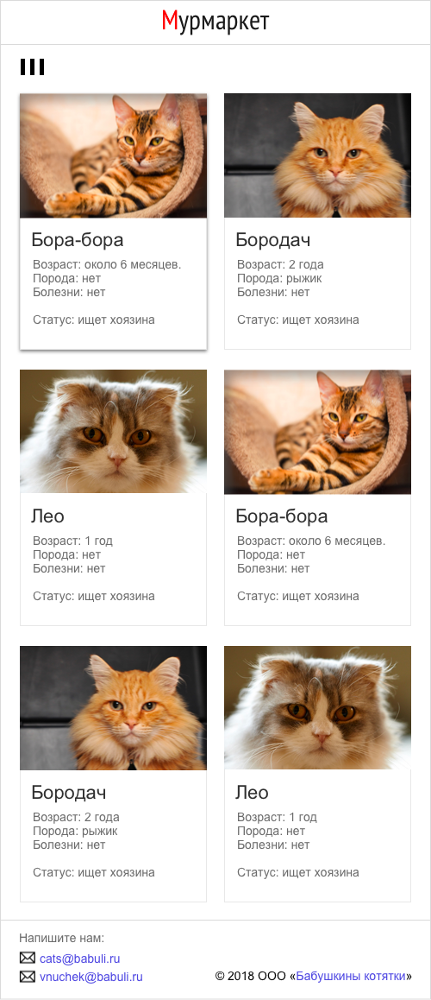
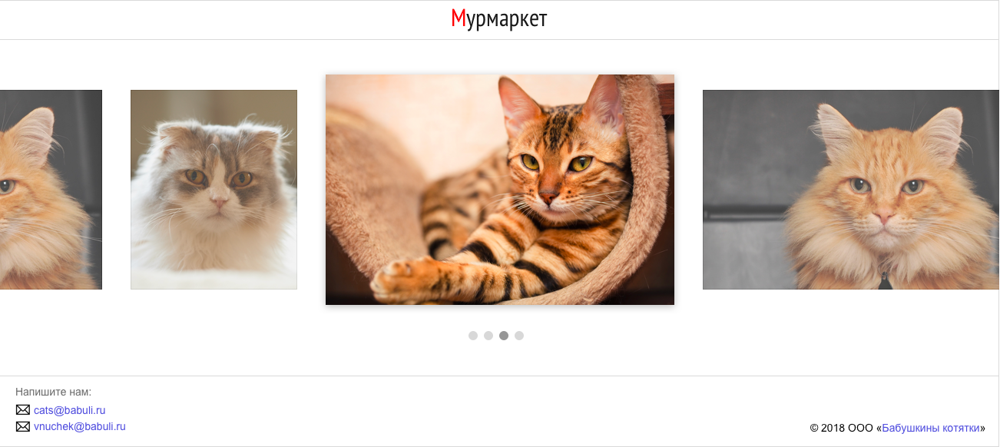
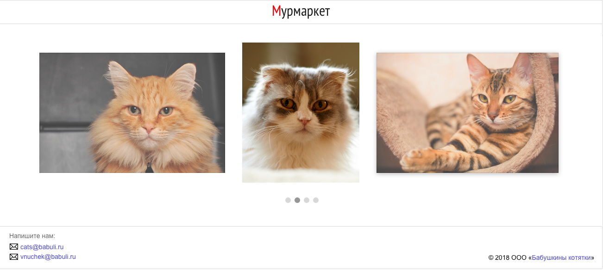
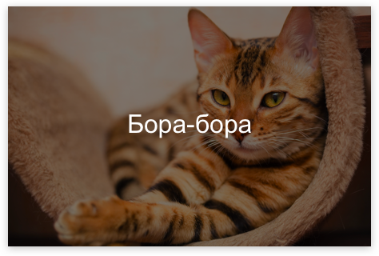
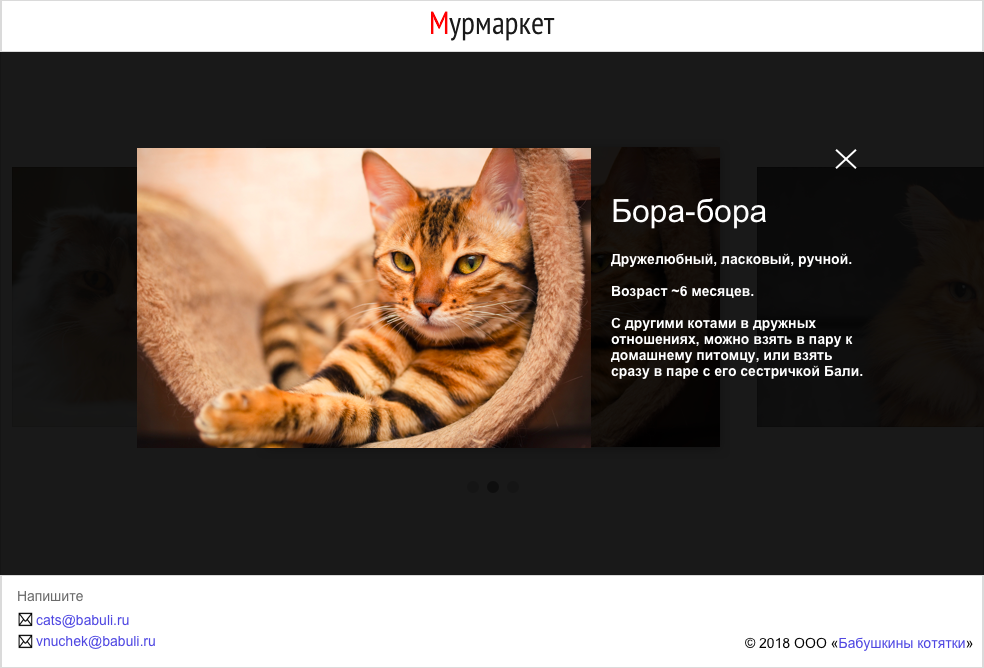

# Задача №1 "Мурмаркет"
​
## Как отправить решение:
1. Склонируйте репозиторий ([тут](pull.md) есть описание как это сделать).
2. Напишите код в файлах ```about-cats/src/index.css``` ```about-cats/src/index.html```
3. Отправьте Pull Request. В качестве commit message пишите что изменилось.

## Основное задание
Задание по-прежнему необходимо решить **без использования JS и flex/grid**(даже если вы уже погуглили что это такое).

У моей бабуленьки очень много котиков (=^･ｪ･^=), но бабуленька уже в возрасте, и ей тяжело. Нужно помочь ей найти котикам новый дом. Что справится с этой задачей лучше, чем сайт, где можно подобрать себе идеального котика без регистрации и смс?



Параметры шапки:

**Размер текста в шапке**: 32px, шрифт: PT SansNarrow

**Размер текста в футере**: 14px, цвет ссылок - #4c4cd8, шрифт - Arial

**Условия**: футер всегда должен быть прибит к низу, шапка должна всегда отображаться вверху, даже при скролле страницы.

К тому же на большом экране список смотрится не так уж и эффектно. Давайте сделаем переключение на галерею-карусель. Так же будет сильно лучше, правда?)



### Описание галереи:

- фотографии листаются по клику на неактивную фотку. На скриншоте выше изначальное состояние галереи, ниже – состояние после того, как галерею пролистнули на 1 фото влево


- активная фотография всегда находится по центру и имеет opacity: 1
- неактивные фотографии имеют opacity: 0.7, и высоту - 80% от главной
- при ховере на активную фотографию фотография немного затемняется и видно имя котика. Так:


- при нажатии на активную фотографию открывается модальное окно. Вот так:


- модальное окно можно закрыть с помощью крестика в правом верхнем углу
- cодержимое центрируется по вертикали и горизонтали.

## Рекомендации к написанию кода:
⚠️Эти пункты учитываются при проверке⚠️

- Соблюдайте семантику - важно выработать привычку называть все своими именами
- HTML-разметка и css должны быть валидными - проверьте на сайте W3C [html](https://validator.w3.org/), [css](https://jigsaw.w3.org/css-validator/)
- В CSS не используйте универсальные селекторы и по идентификаторам, если в этом нет необходимости
- В CSS не используются селекторы элементов (кроме случаев, когда это селектор охватывает 1-2 элемента, например, body или html). Предпочтительны селекторы классов
- Старайтесь не дублировать название одного и того же класса, а селекторы с одинаковым набором правил группируются в один через запятую
- Не используйте !important и инлайн-стили, если в этом нет необходимости, а если есть причины - опишите в комментариях в коде
- Решение должно корректно отображаться и работать в последних версиях современных браузеров (Chrome, Firefox, Safari, YandexBrowser)
- Пишите комментарии в коде, почему приходится нарушать рекомендации

